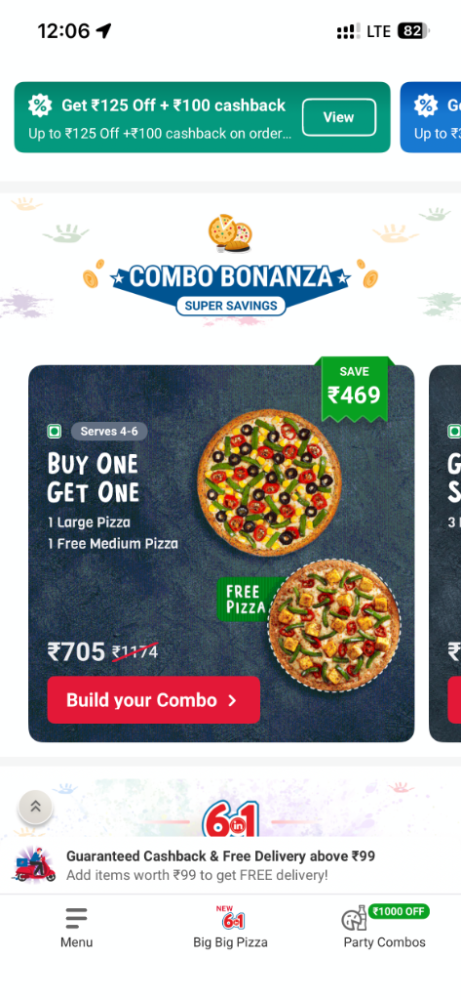
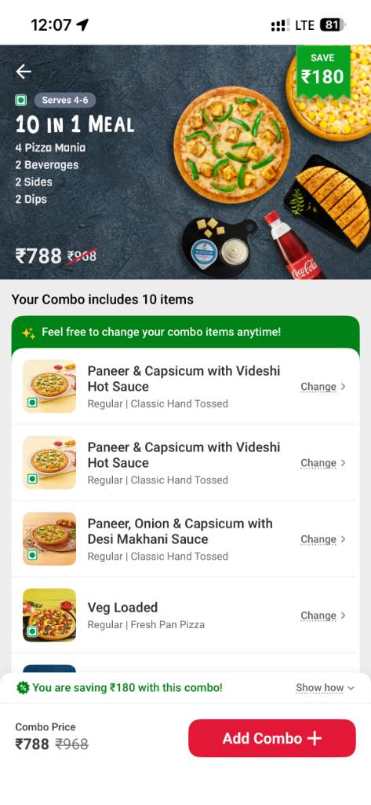
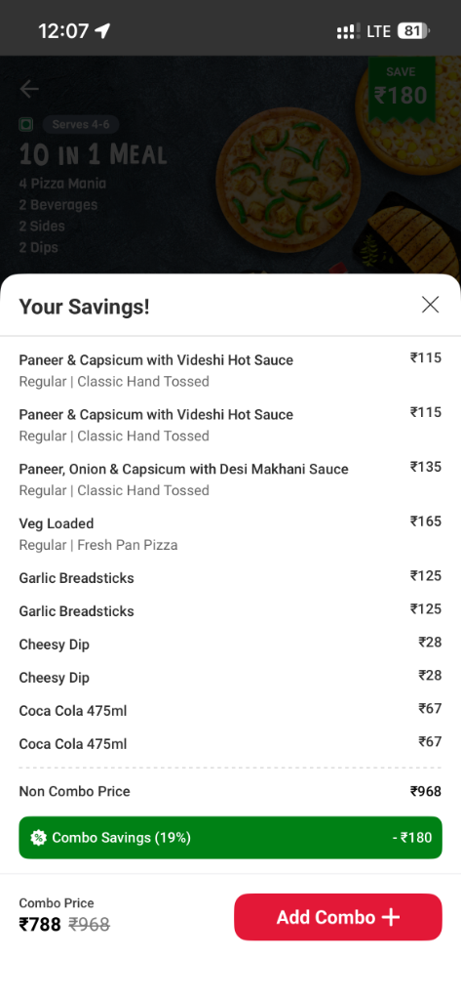
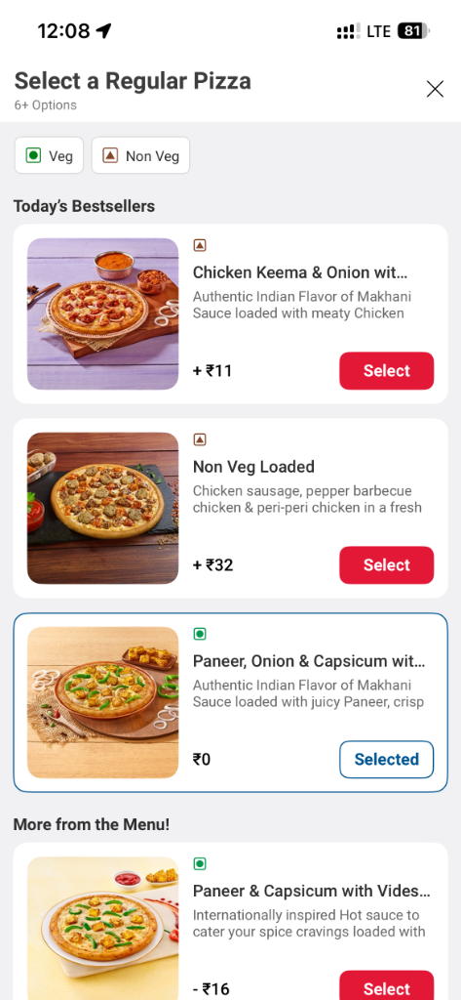
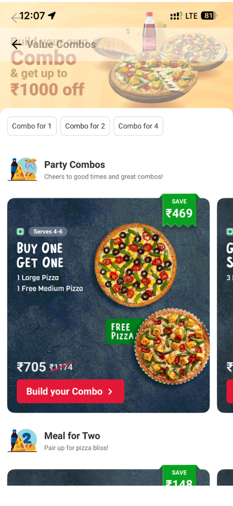
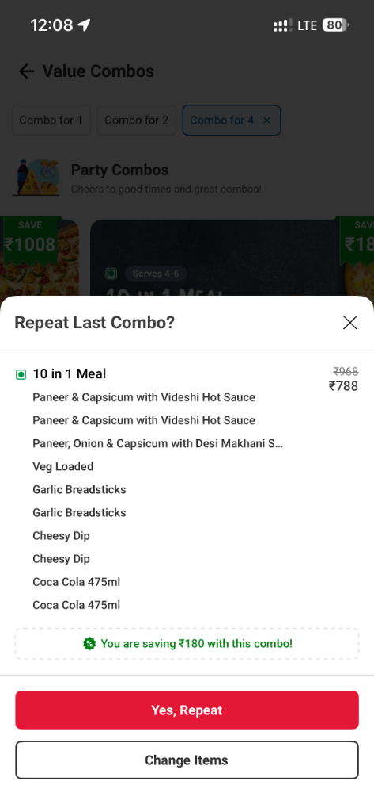
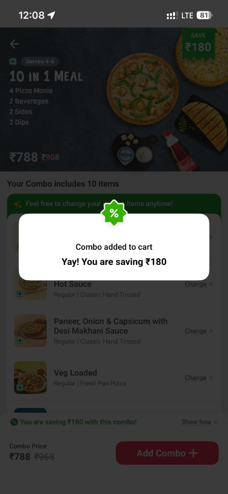
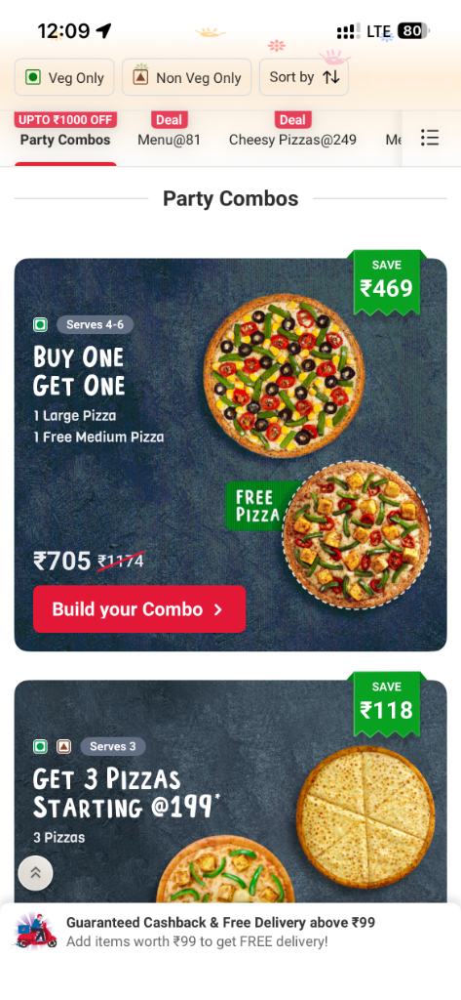

# 🍕 Dynamic Combo Project – Domino’s India App

One of the most impactful and technically enriching projects I worked on was the **Dynamic Combo** feature for the **Domino’s India mobile app**. The motivation behind this project was to offer users the ability to create highly customisable combos with a dynamic pricing and savings mechanism, enhancing both **user engagement** and **average order value**.

## ✨ Key Features

The feature allowed users to:
- Browse a list of curated **combo templates**.
- **Build their own combos** from selected templates.
- Swap or customise **individual items** within combos.
- View **dynamic pricing** and real-time **savings**.
- **Edit combos** directly from the cart.

---

## 📸 Screenshots

  
  &nbsp;&nbsp;&nbsp;&nbsp;
  
  &nbsp;&nbsp;&nbsp;&nbsp;
  
    
  
  &nbsp;&nbsp;&nbsp;&nbsp;
  
  &nbsp;&nbsp;&nbsp;&nbsp;
  
    
  
  &nbsp;&nbsp;&nbsp;&nbsp;
  

---

## 🛠️ My Core Contributions

### 1. Designed and Built Multiple Screens
- **Combo Listing Screen:** Displays various combo templates categorized for user selection. I implemented the UI/UX logic to support multiple entry points (home page, menu, cart, left nav, etc.) while maintaining consistent navigation and analytics tracking.
- **Combo Builder Screen:** A dynamic interface where users can configure combos based on the template. Built flexible view components to handle varying item types and layouts.
- **Change Item Screen:** Triggered when a user wants to replace an item. I built a reusable screen that supports filtering and searching alternative items with necessary validations.

### 2. Implemented Dynamic Bottom Sheets
- **Savings Sheet:** Showcases real-time calculated savings based on the selected items in the combo.
- **Repeat Last Combo Sheet:** Allows users to quickly reorder or edit their previous combo selections.
- **Out of Stock Sheet:** Lists unavailable items in a combo, with graceful degradation and suggestions.

### 3. Handled Multiple Entry Points
- Designed and handled navigation to the combo flow from various parts of the app—ensuring **state preservation**, **analytics logging**, and **deep link support**.

---

## 💻 Technical Highlights
- Used **MVC/MVVM architecture** with custom reusable UI components to handle modular item views across screens.
- Managed **state restoration** across complex navigation flows and handled memory efficiency.
- Implemented **delegate patterns**, and data flow consistency across screens.
- Collaborated with **backend teams** to handle combo logic, dynamic pricing, and item availability.
